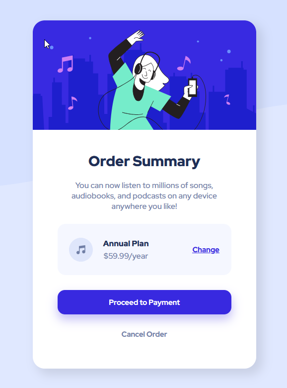

# Frontend Mentor - NFT preview card component solution

This is a solution to the [NFT order summary component challenge on Frontend Mentor](https://www.frontendmentor.io/challenges/order-summary-component-QlPmajDUj). Frontend Mentor challenges help you improve your coding skills by building realistic projects. 


### Screenshot




### Built with

- Flexbox
- Pseudo-Elements
- Media Queries

### What I learned

- Using CSS Flexbox
- How to add small icons to text using the CSS pseudo element ::before
- Using Media Queries
- Using Box Shadows
- Using Background shortcuts

### Code snippets

```css
/* Extra small devices (phones, 600px and down) */
@media only screen and (max-width: 600px) {
  /* ... */
}

/* offset-x | offset-y | blur-radius | spread-radius | color */
box-shadow: 0px 10px 20px 0.5px hsla(245, 75%, 52%, .3);

/* Background short */
background: var(--pale-blue) url(images/pattern-background-mobile.svg) no-repeat;
```
